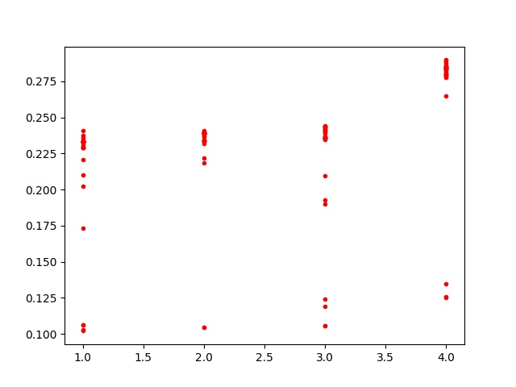

# bmpProject : Multi-thread 기반 이미지 파일 (BMP) 처리 프로그램 작성  
- BMP 파일 로드 (mmap() 활용)  
- CPU 코어 개수 만큼의 N개의 Thread 생성  
- 각 Thread를 CPU affinity를 이용하여 각 CPU 코어에 할당  
- BMP 파일을 N개의 구역으로 나누고 N개의 Thread가 동시에 이미지 처리를 수행(e.g., 이미지 밝기 조절)  
- 최종 결과는 새로운 파일에 저장  
- 실행 Thread 개수에 따른 수행 시간 비교  

# Compilation
```
make
```
# Execution
```
./auto.out
```
or
```
./bmpMain.out <bitmap file path> <new file path> <Num of Thread>
```
and then execute a python file to create a chart image to compare the time taken by the number of threads used.
you need to activate a virtual environment before executing chart.py.
```
. venv/bin/activate
python3 chart.py
```

## example
```
./bmpMain.out sample.bmp sample_new.bmp 4
```

# Result
## Before  
  
  
## After  
### Vertical
  
### Horizontal
  
### Window-like


## Execution time  
  